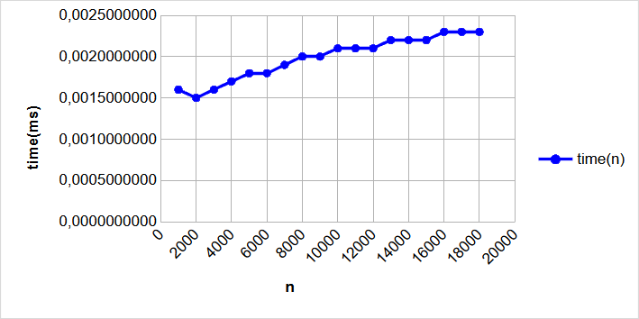
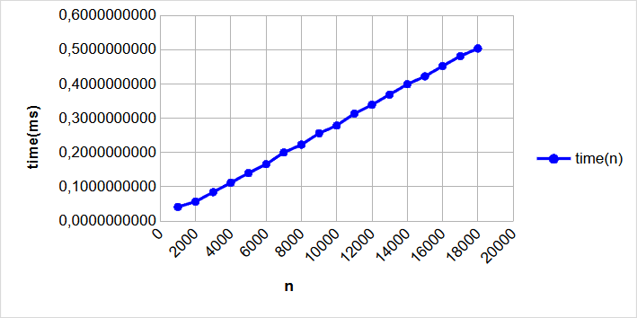
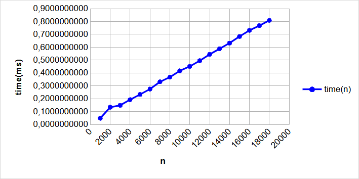
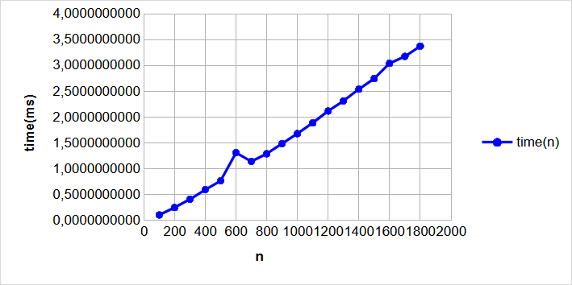
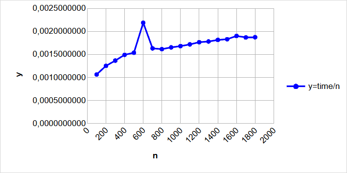
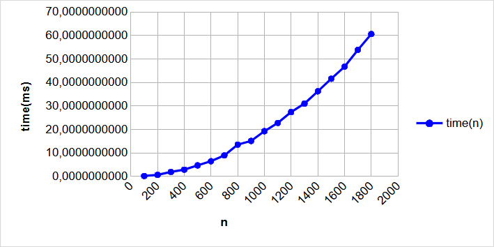
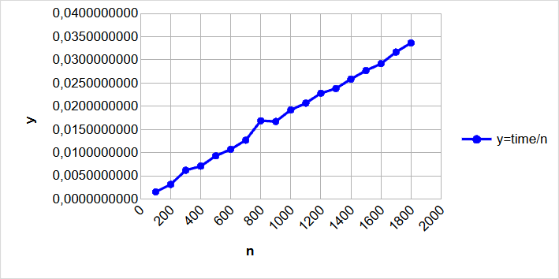
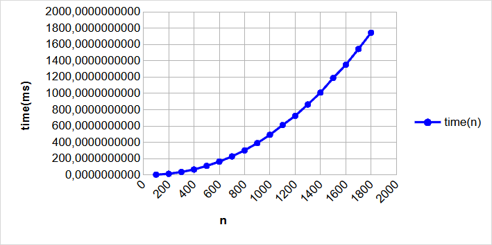
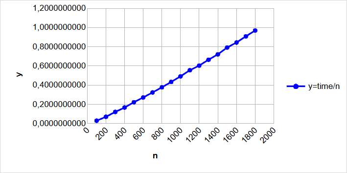

# Группа ИДБ-25-06, 16.03.2026, Лабораторная работа №1

## Вводные данные

- язык программирования: Python
- операционная система: Windows 11

## Функции
| №  | Функция | Сложность |
|----|---------|-----------|
| 04 | `f04_lower_bound` | **O(log n)** |
| 08 | `f08_find_min` | **O(n)** |
| 12 | `f12_is_sorted` | **O(n)** |
| 16 | `f16_heap_sort` | **O(n log n)** |
| 20 | `f20_insertion_sort` | **O(n²)** |
| 24 | `f24_three_sum_bsearch` | **O(n² log n)** |

## Функция f04_lower_bound

Lower bound — индекс первого элемента ≥ key

Код:
> [Ссылка на файл functions.py](./src/functions.py)

Таблица результатов:

| Размер n | Время выполнения, мс |
|:--------:|:-------------------:|
| 1000     | 0,0015999831        |
| 2000     | 0,0015000114        |
| 3000     | 0,0016000122        |
| 4000     | 0,0017000129        |
| 5000     | 0,0018000137        |
| 6000     | 0,0018000137        |
| 7000     | 0,0019000145        |
| 8000     | 0,0020000152        |
| 9000     | 0,0019999570        |
| 10000    | 0,0021000160        |
| 11000    | 0,0020999869        |
| 12000    | 0,0021000160        |
| 13000    | 0,0022000168        |
| 14000    | 0,0022000168        |
| 15000    | 0,0022000168        |
| 16000    | 0,0023000175        |
| 17000    | 0,0023000175        |
| 18000    | 0,0023000175        |
| 19000    | 0,0023000175        |
| 20000    | 0,0024499896        |

График с зависимостью времени выполнения от количества элементов:

  

Из графика видно характерное поведение логарифмической сложности O(log n). При экспоненциальном росте размера массива время выполнения увеличивается крайне медленно.

## Функция f08_find_min

Функция находит минимальный элемент в массиве путем последовательного перебора. Выполняется за линейное время O(n). Важной особенностью алгоритма является то, что он всегда обходит массив целиком, независимо от расположения минимального элемента.

Код:
> [Ссылка на файл functions.py](./src/functions.py)

Таблица результатов:

| Размер n | Время выполнения, мс |
|:--------:|:-------------------:|
| 1000     | 0,0411500223        |
| 2000     | 0,0566000235        |
| 3000     | 0,0841499714        |
| 4000     | 0,1118500077        |
| 5000     | 0,1396499865        |
| 6000     | 0,1656500099        |
| 7000     | 0,1998499793        |
| 8000     | 0,2226000070        |
| 9000     | 0,2559499699        |
| 10000    | 0,2783499949        |
| 11000    | 0,3132999991        |
| 12000    | 0,3391499631        |
| 13000    | 0,3688499855        |
| 14000    | 0,3989000106        |
| 15000    | 0,4219500115        |
| 16000    | 0,4518500064        |
| 17000    | 0,4808499943        |
| 18000    | 0,5032499903        |
| 19000    | 0,5358500057        |
| 20000    | 0,5635000416        |

График с зависимостью времени выполнения от количества элементов:

  

Из графика отчетливо видна линейная зависимость времени выполнения от количества элементов. График представляет собой прямую линию. Это подтверждает теоретическую асимптотику алгоритма O(n).

## Функция f12_is_sorted

Проверка, отсортирован ли массив по неубыванию.
Один проход с проверкой a[i] >= a[i-1].  O(n).

Код:
> [Ссылка на файл functions.py](./src/functions.py)

Таблица результатов:

| Размер n | Время выполнения, мс |
|:--------:|:-------------------:|
| 1000     | 0,0480000162        |
| 2000     | 0,1337999711        |
| 3000     | 0,1486000256        |
| 4000     | 0,1927500125        |
| 5000     | 0,2329499694        |
| 6000     | 0,2750099993        |
| 7000     | 0,3311500186        |
| 8000     | 0,3673999745        |
| 9000     | 0,4168000014        |
| 10000    | 0,4511000006        |
| 11000    | 0,4954499891        |
| 12000    | 0,5444500130        |
| 13000    | 0,5879499950        |
| 14000    | 0,6321999826        |
| 15000    | 0,6831999926        |
| 16000    | 0,7308999775        |
| 17000    | 0,7674999943        |
| 18000    | 0,8085499867        |
| 19000    | 0,8578999841        |
| 20000    | 0,9086999926        |

График с зависимостью времени выполнения от количества элементов:

  

Из графика отчетливо видна линейная зависимость времени выполнения от количества элементов. График представляет собой прямую линию. Это подтверждает теоретическую асимптотику алгоритма O(n).

## Функция f16_heap_sort

Пирамидальная сортировка (heap sort)

Код:
> [Ссылка на файл functions.py](./src/functions.py)

Таблица результатов:

| Размер n | Время выполнения, мс |
|:--------:|:-------------------:|
| 100      | 0,1064499957        |
| 200      | 0,2501999843        |
| 300      | 0,4097000347        |
| 400      | 0,5963500007        |
| 500      | 0,7681499992        |
| 600      | 1,3122999808        |
| 700      | 1,1414999933        |
| 800      | 1,2916499982        |
| 900      | 1,4870500017        |
| 1000     | 1,6808000219        |
| 1100     | 1,8878999981        |
| 1200     | 2,1181500051        |
| 1300     | 2,3137000098        |
| 1400     | 2,5407000212        |
| 1500     | 2,7446500026        |
| 1600     | 3,0404999886        |
| 1700     | 3,1752999930        |
| 1800     | 3,3725500107        |
| 1900     | 3,6646499939        |
| 2000     | 3,9617500152        |

График с зависимостью времени выполнения от количества элементов:

  

График с зависимостью (времени/количества элементов) выполнения от количества элементов:

  

По второму графику можно сказать, что time(n) приблизительно равен O(n log n)
т.к. time/n = log n.

## Функция f20_insertion_sort

Сортировка вставками (insertion sort)

Каждый новый элемент «вставляется» в уже отсортированную
часть массива, сдвигая бОльшие элементы вправо.  O(n^2).

Код:
> [Ссылка на файл functions.py](./src/functions.py)

Таблица результатов:

| Размер n | Время выполнения, мс |
|:--------:|:-------------------:|
| 100      | 0,1580000098        |
| 200      | 0,6360500120        |
| 300      | 1,8653500010        |
| 400      | 2,8450500104        |
| 500      | 4,6605999814        |
| 600      | 6,4450000064        |
| 700      | 8,8955000105        |
| 800      | 13,5202499805       |
| 900      | 15,0654999889       |
| 1000     | 19,2223500053       |
| 1100     | 22,7437499852       |
| 1200     | 27,3755499882       |
| 1300     | 30,9668999980       |
| 1400     | 36,1948999634       |
| 1500     | 41,5353499993       |
| 1600     | 46,6775000095       |
| 1700     | 53,8464999987       |
| 1800     | 60,5732499971       |
| 1900     | 68,8474999912       |
| 2000     | 75,7917999872       |

График с зависимостью времени выполнения от количества элементов:

  

График с зависимостью (времени/количества элементов) выполнения от количества элементов:

  

График представляет собой ярко выраженную параболу, что является подтверждением асимптотики O(n²).
Из графика отчетливо видна линейная зависимость времени делённого на размер выполнения от количества элементов, соответственно сложность равна O(n²).

## Функция f24_three_sum_bsearch

Поиск тройки с суммой target (с бинарным поиском)
Фиксируем пару (i, j), ищем третий элемент
need = target − a[i] − a[j] бинарным поиском
среди a[j+1 .. n−1].
Пар C(n,2), каждый поиск O(log n) ⇒ O(n² log n).
ВАЖНО: массив должен быть отсортирован!

Код:
> [Ссылка на файл functions.py](./src/functions.py) 

Таблица результатов:

| Размер n | Время выполнения, с |
|:--------:|:-------------------:|
| 100      | 2,896799970         |
| 200      | 14,0783999814       |
| 300      | 36,2825000193       |
| 400      | 66,5703999694       |
| 500      | 110,9464999754      |
| 600      | 162,8439000342      |
| 700      | 226,6980999848      |
| 800      | 301,2901999755      |
| 900      | 389,7686999990      |
| 1000     | 491,5693000075      |
| 1100     | 610,4835000006      |
| 1200     | 724,3468000088      |
| 1300     | 863,7497999589      |
| 1400     | 1009,2730000033     |
| 1500     | 1187,8775999649     |
| 1600     | 1349,9313999782     |
| 1700     | 1543,2333000354     |
| 1800     | 1743,9806999755     |
| 1900     | 1970,7661000430     |
| 2000     | 2187,9818000016     |

График с зависимостью времени выполнения от количества элементов:

  

График с зависимостью (времени/количества элементов) выполнения от количества элементов:

  

По графикам можно сказать, что time(n) приблизительно равно O(n² log n).

